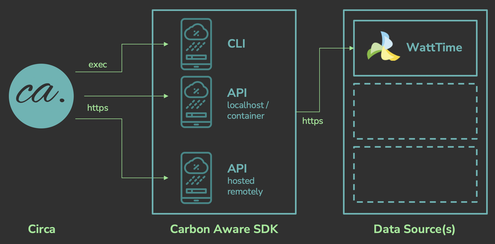
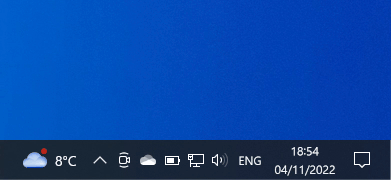

# Circa - carbon nice scripting

> _ca._, abbreviation for _circa (latin)_, meaning approximately


## Installation

Download a [release](https://github.com/woodcoder/circa/releases) and build it
using something like the following:

```
curl -LO https://github.com/woodcoder/circa/releases/download/v0.2/circa-0.2.tar.gz
tar -xf circa-0.2.tar.gz
cd circa-0.2
./configure
make
sudo make install
```

(You will need to ensure that you have the Curl and Jansson libraries
installed.  See the [Building on...](#building-on-macos) sections below for
easy package manager one liners to do this.)


## Usage

```
ca [option ...] hours [command [argument ...]]
```

The `ca` command will check the Carbon Aware API for the optimal time in the
next few *HOURS* to run the *COMMAND* to make use of the lowest forecast carbon
intensity energy.  If no *COMMAND* is supplied, the program will just block
(sleep) until that time.

Circa is a [Carbon Hack 22](https://taikai.network/en/gsf/hackathons/carbonhack22/overview)
[Project](https://taikai.network/gsf/hackathons/carbonhack22/projects/cl96vd1rs165126301uhinaxqpn0/idea).

### Options

<dl>
  <dt><b>-l</b> &lt;location&gt;</dt>
  <dd>
    specify
    <a href="https://github.com/Green-Software-Foundation/carbon-aware-sdk/blob/dev/src/CarbonAware.LocationSources/CarbonAware.LocationSources.Azure/src/azure-regions.json">
      location
    </a>
    to check for carbon intensity
  </dd>
  <dt><b>-d</b> &lt;duration&gt;</dt>
  <dd>estimated window of runtime of command/task in minutes</dd>
  <dt><b>-u</b> &lt;sdk url&gt;</dt>
  <dd>
    url prefix of Carbon Aware API server to consult OR<br>
    full path to [Carbon Aware CLI](#carbon-aware-cli) executable
  </dd>
</dl>

### Configuration

Defaults for the _url_ and _location_ settings can be configured system-wide or
per user by using a [config file](circa.conf).  This should be placed in
`/etc/circa.conf` or/and `~/.circa/config`.  These defaults are overridable by
the command line options above.


## Architecture



<small><a href="https://www.flaticon.com/free-icons/forecast-analytics" title="forecast analytics icons">Forecast analytics icon created by photo3idea_studio - Flaticon</a></small>


## Examples

On Linux, you could run the following to pop up a reminder to charge your latop for a couple of hours:

```
ca -d 120 8 notify-send "Lower Carbon Energy Available" "Why not plug in your charger?"
```

On macOS, this does a similar thing:

```
ca -d 120 8 osascript -e 'display notification "Why not plug in your charger?" with title "Lower Carbon Energy Available"'
```

If you install it with WSL under Windows, you can do something similar with this PowerShell script:

```
function Show-Notification {
    param (
        [string] $ToastText1,
        [string] $ToastText2
    )

    $Notification = "<toast>
      <visual>
        <binding template='ToastText02'>
          <text id='1'>$($ToastText1)</text>
          <text id='2'>$($ToastText2)</text>
        </binding>
      </visual>
    </toast>"

    $null = [Windows.UI.Notifications.ToastNotificationManager, Windows.UI.Notifications, ContentType=WindowsRuntime]
    $null = [Windows.Data.Xml.Dom.XmlDocument, Windows.Data, ContentType=WindowsRuntime]

    $NotificationXml = New-Object Windows.Data.Xml.Dom.XmlDocument
    $NotificationXml.LoadXml($Notification)

    $Toast = [Windows.UI.Notifications.ToastNotification]::new($NotificationXml)
    $Toast.Tag = "Carbon Aware"
    $Toast.Group = "Carbon Aware"
    $Toast.ExpirationTime = [DateTimeOffset]::Now.AddMinutes(1)

    $Notifier = [Windows.UI.Notifications.ToastNotificationManager]::CreateToastNotifier("Carbon Aware")
    $Notifier.Show($Toast);
}

wsl ca -d 120 8
Show-Notification "Lower Carbon Energy Available" "Why not plug in your charger?"
```

Save the above in a file (e.g. `carbon-aware.ps1`) and run it from a Windows
PowerShell prompt.  You may need to run
`Set-ExecutionPolicy -Scope Process -ExecutionPolicy Bypass`
in your PowerShell window first.




## Motivation

Inspiration for circa came from thinking about the question "what's the
simplest thing that just might work?!".

It would be great to replace cron with a carbon aware version, as there are
very many daily jobs that are not time sensitive, and that are just kicked off
at midnight, 4am, 6am or similar times because the ops team have to pick a
'quiet' time for them.

However, replacing cron on a system feels like a tricky business.  It's a core
bit of server infrastructure, so there are trust and security issues.

You'd also need to change the crontab syntax to add in options for a deadline
by when you'd like the task to start by and, ideally information about how long
it might take to run.  To make this backwards compatible would be tricky too.

Hmmm.

So, what about trying to create something that's sort of unix-y, kind of in the 
composable component philosophy zone?  Something a bit `nice` maybe?  Or
perhaps in keeping with `at` and `batch`?  What might that look like?

```
ca 6h my-cpu-intensive-script.sh
```

Oh, that looks pretty easy to use!

You could also use it in a shell script around specific commands.

And, maybe, you could use it in a crontab after all:

```
0 0 * * * /usr/local/bin/ca 6h /path/to/my/daily-report-script.sh
```

But, hang on a mo - if that took off, then actually, it might provide quite a
neat configuration syntax for an carbon aware cron (cacron) too?  Like a sort
of incremental adoption path where sysadmins could just install `ca` to time
shift one-off tasks.  And then, in time, could update cron, which would skip
calling `ca` and just use it as a syntax to inform its own overarching carbon
aware schedule.

And that would leave me not having to worry when I schedule my reporting or
update checking scripts - I could just let cacron crack on with it whenever the
local grid's carbon intensity was at its lowest.

Happy days.


## Contributing

Feel free to contact me (woodcoder) on github, taikai or discord.

### Building on macOS

```
brew install pkg-config autoconf automake libtool libcurl jansson
autoreconf -fi -I /usr/local/opt/curl/share/aclocal
./configure
make
```

### Building on Ubuntu

```
sudo apt-get install -y build-essential libcurl4-openssl-dev libjansson-dev
autoreconf -fi
./configure
make
```

### Building on Fedora

```
sudo dnf -y install autoconf automake curl-devel jansson-devel
autoreconf -fi
./configure
make
```

### Building on Manjaro

```
sudo pacman -S base-devel curl jansson
autoreconf -fi
./configure
make
```


## Carbon Aware CLI

To install the SDK CLI you will first need the .NET SDK

   * macOS - download and install the [macOS .NET SDK Installer](https://dotnet.microsoft.com/en-us/download/dotnet/6.0).
   * Ubuntu - `sudo apt-get install -y dotnet-sdk-6.0`
   * Fedora - `sudo dnf -y install dotnet`
   * Manjaro - `sudo pacman -S dotnet-sdk aspnet-runtime`

Then you will need the *new* CLI redesign
[pull request](https://github.com/Green-Software-Foundation/carbon-aware-sdk/pull/158) branch:
```
curl -LO https://github.com/microsoft/carbon-aware-sdk/archive/refs/heads/162/cli-redesign.tar.gz
tar xf cli-redesign.tar.gz
cd carbon-aware-sdk-162-cli-redesign/src/CarbonAware.CLI/src
```

Update the `appsettings.json`, for example, with your WattTime credentials:
```
vi appsettings.json 
{
    "Logging": {
      "LogLevel": {
        "Default": "Information",
        "Microsoft.AspNetCore": "Warning"
      }
    },
    "AllowedHosts": "*",
    "carbonAwareVars": {
        "carbonIntensityDataSource": "WattTime"
    },
    "wattTimeClient": {
        "username": "<watttime username>",
        "password": "<watttime password>"
    }
}
```

Build a release and test it:
```
dotnet publish -c Release
bin/Release/net6.0/publish/caw emissions -l eastus
```
